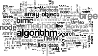

# Welcome to Samuel Liu's User Page

As Abraham Lincoln once said
> Hello!

I am a ~~first-year~~ *second-year* student studying **Computer Science at _UC San Diego_**. This page will be all about me :smiley:

**Page Sections**
- [Current Involvemnts](https://github.com/samliu000/CSE-110-Lab-1/blob/gh-pages/index.md#current-involvments)
- [Contact Me](https://github.com/samliu000/CSE-110-Lab-1/blob/gh-pages/index.md#contact-me)

## Current Involvments

### CSE Tutor
I am a CSE Tutor for **CSE 12**, Basic Data Structures 
and Object Oriented Design. 
We program in Java/C++ so the **code** we write would look something like

`BinTree ourTree = new BinTree();`

[Here is a relative Link to the image](./DSImage.png)

### Classes
Here are the classes that I am currently taking
- CSE 110
- CSE 101
- MATH 183
- CSE 95
  - Tutoring for CSE 12 under Gary Gillespie

Here are some classes that I want to take in the future
- [ ] CSE 151A
- [ ] CSE 152A
- [ ] CSE 141
- [ ] CSE 141L
- [x] CSE 100

Here are my favorite classes
| Fav Classes | 
| --- | 
| CSE 100 |
| CSE 11 |
| CSE 30 |

### Hobbies
1. Cooking
2. Planting
  - Herbs
  - Tomatoes
  - Spring Onions
3. Gaming

## Contact Me
Email: samuel.liu1004@gmail.com
Linkedin: [https://www.linkedin.com/in/samuel-liu-1004/](https://www.linkedin.com/in/samuel-liu-1004/)
[Checkout my Resume](https://drive.google.com/file/d/1LiFEOE6UpPLI0XWSsHU4Pg6fPoiXXSgM/view?usp=sharing)
